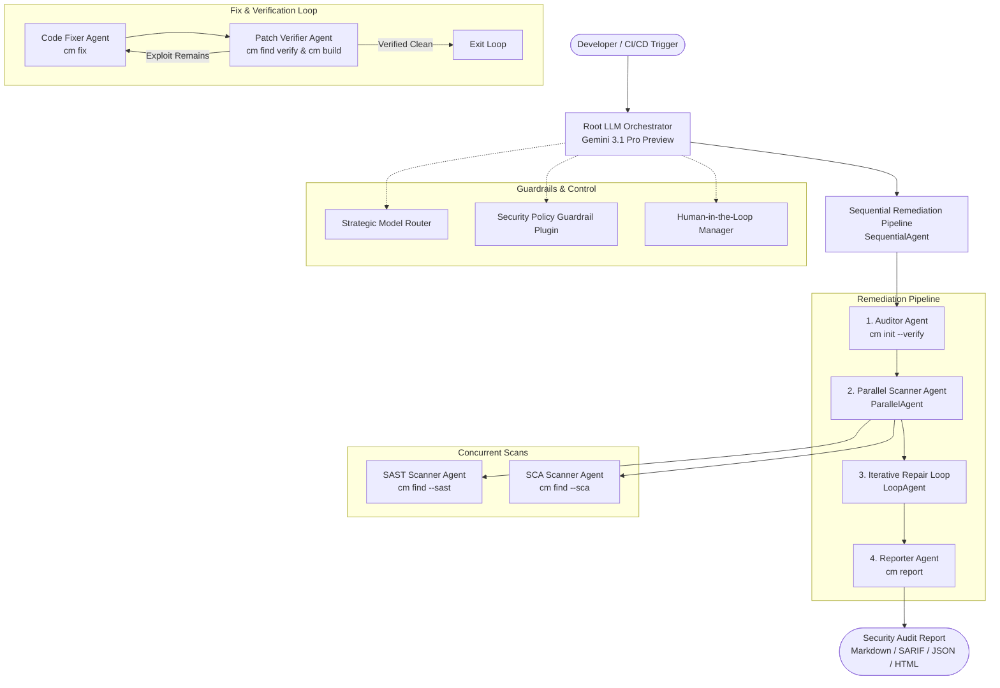

# Google Cloud CodeMender Agent 🛡️

[](https://github.com/googlecloudplatform/codemender-agent/actions)
[](https://www.python.org/downloads/)
[](https://github.com/google/adk-python)
[](https://cloud.google.com/vertex-ai)

> An enterprise-grade, autonomous code security and vulnerability remediation agent built with the **Google Agent Development Kit (ADK)** and powered by **Google Gemini** models. Seamlessly integrates with Google Cloud's **CodeMender (`cm`) CLI** to find, verify, and fix deep vulnerabilities in local code repositories.

---

## Table of Contents

- [Overview](#overview)
- [Key Capabilities](#key-capabilities)
- [Multi-Agent Architecture & Workflow](#multi-agent-architecture--workflow)
- [Prerequisites](#prerequisites)
- [Installation & Setup](#installation--setup)
- [Development Environment Setup](#development-environment-setup)
- [Common Development Commands](#common-development-commands)
- [Codebase Structure](#codebase-structure)
- [How to Extend & Continue Development](#how-to-extend--continue-development)
- [CI/CD & Infrastructure as Code (IaC)](#cicd--infrastructure-as-code-iac)
- [Security & Data Privacy](#security--data-privacy)
- [License](#license)

---

## Overview

**Google Cloud CodeMender Agent** provides an end-to-end autonomous security remediation pipeline. It couples high-reasoning Gemini models (`gemini-3.1-pro-preview` and `gemini-3.5-flash`) with local workspace mediation to scan source code, filter false positives in reproduction sandboxes, generate unified patch diffs, and verify that fixes pass all regression test suites before deployment.

---

## Key Capabilities

1. **Tool & Interface Design**: Strict Pydantic JSON validation schemas for LLM tool calling, structured error recovery instructions, and full coverage of the CodeMender (`cm`) CLI command tree.
2. **Context & Memory**: Persistent SQLite session state management via `SqliteSessionService`, async memory operations, and token-aware history compaction.
3. **Orchestration & Logic**: Strategic Model Routing (Flash for fast scanning, Pro for complex patch synthesis), `SequentialAgent`, `ParallelAgent`, `LoopAgent`, and Human-in-the-Loop (HITL) approval stops.
4. **Observability & Tracing**: Structured JSON logging, OpenTelemetry distributed tracing spans, automated PII / GCP API secret redaction (`PIIRedactor`), and cognitive intent vs. observed outcome tracking.
5. **Infrastructure & CI/CD**: Automated regression evaluation suite with a golden benchmark dataset, containerization (Dockerfile & Docker Compose), Kubernetes manifests, and Terraform Cloud Run / Secret Manager provisioning.

---

## Multi-Agent Architecture & Workflow

The agent utilizes a hierarchical multi-agent design built with Google ADK:



---

## Prerequisites

- **Python**: Version 3.10 or higher (Python 3.11–3.14 supported).
- **Google Cloud SDK (`gcloud`)**: Configured with Application Default Credentials (ADC).
- **CodeMender CLI (`cm`)**: Installed and available on `$PATH` (e.g., `/usr/local/bin/cm`).
- **Git**: Configured version control system.

---

## Installation & Setup

### 1. Clone the Repository
```bash
git clone https://github.com/liangzhang-collab/cm-demo-agent.git
cd cm-demo-agent
```

### 2. Create and Activate a Virtual Environment
```bash
python3 -m venv .venv
source .venv/bin/activate  # On Windows: .venv\Scripts\activate
```

### 3. Install Dependencies
```bash
pip install -r requirements.txt
```

---

## Development Environment Setup

### 1. Configure Google Cloud Credentials
CodeMender uses Google Cloud Application Default Credentials (ADC) to interact with cloud reasoning engines:
```bash
gcloud auth application-default login
```

### 2. Environment Variables
Create a local `.env` file or export the required environment variables:
```bash
# Gemini API Key & Vertex AI Settings
export GEMINI_API_KEY="your-gemini-api-key"
export GOOGLE_CLOUD_PROJECT="your-gcp-project-id"

# CodeMender Secret Manager (Optional)
export GCP_SECRET_MANAGER_PROJECT_ID="your-gcp-project-id"
```

### 3. Initialize CodeMender Workspace
Run `cm init` to initialize state tracking and verify cloud connectivity:
```bash
cm init --verify
```

---

## Common Development Commands

### Run Unit and Integration Tests
Execute the full test suite with `pytest`:
```bash
PYTHONPATH=. pytest -v
```

### Run Automated Regression Evaluation Suite
Benchmark agent scanning, fix generation, and verification accuracy against the golden dataset:
```bash
PYTHONPATH=. python3 -m codemender_agent.cicd.eval_suite
```

### Build & Run Container Locally
```bash
# Build Docker image
docker build -t codemender-agent .

# Run with Docker Compose
docker compose up
```

### Deploy Cloud Infrastructure (Terraform)
```bash
cd terraform
terraform init
terraform plan
terraform apply
```

---

## Codebase Structure

```
├── codemender_agent/            # Main Agent Package
│   ├── agents/                  # Multi-Agent Definitions
│   │   ├── orchestrator.py      # Root LLM Orchestrator & SequentialAgent
│   │   ├── auditor.py           # Environment & Workspace Auditor Agent
│   │   ├── scanners.py          # Parallel SAST & SCA Scanner Agents
│   │   ├── fixer.py             # Iterative Patch Fixer & Verifier LoopAgent
│   │   ├── reporter.py          # Security Report Generation Agent
│   │   ├── model_router.py      # Strategic Model Tier Router (Flash vs Pro)
│   │   └── hitl.py              # Human-in-the-Loop (HITL) Manager
│   ├── cicd/                    # CI/CD & Evaluation Suite
│   │   ├── eval_suite.py        # Automated Regression Evaluation Harness
│   │   ├── golden_dataset.json  # Benchmark Ground-Truth Vulnerabilities
│   │   └── secrets.py           # Secret Manager Integration & Key Masking
│   ├── plugins/                 # Observability & Security Plugins
│   │   ├── guardrails.py        # Security Policy Guardrail Plugin
│   │   └── observability.py     # OpenTelemetry Tracing, JSON Logs & PII Redactor
│   ├── state/                   # State & Memory Management
│   │   ├── memory.py            # Async Memory & History Compaction
│   │   └── session_db.py        # SQLite Database Persistent Session Service
│   ├── tools/                   # CLI Wrappers & ADK Function Tools
│   │   ├── cli_wrapper.py       # CodeMender (cm) CLI Execution Wrapper
│   │   └── codemender_tools.py  # Pydantic-Validated ADK Function Tools
│   └── config.py                # Data Models & Pydantic Tool Schemas
├── tests/                       # Comprehensive Pytest Suite
│   ├── test_agents.py           # Tests for Sequential, Parallel, and Loop Agents
│   ├── test_eval_regressions.py # Regression Evaluation Suite Tests
│   ├── test_guardrails_and_hitl.py # Policy Guardrails & HITL Tests
│   ├── test_memory.py           # State, Session DB & Compaction Tests
│   ├── test_plugin.py           # Observability, PII Redaction & Tracing Tests
│   ├── test_secrets.py          # Secret Manager & Key Masking Tests
│   └── test_tools.py            # CodeMender Tools & CLI Wrapper Tests
├── terraform/                   # Infrastructure as Code (IaC)
│   ├── main.tf                  # Cloud Run, Secret Manager & GCS Setup
│   ├── variables.tf             # Terraform Input Variables
│   └── outputs.tf               # Terraform Outputs
├── k8s/                         # Kubernetes Deployment Manifests
│   └── deployment.yaml          # K8s Deployment & Service Configuration
├── Dockerfile                   # Production Container Specification
├── docker-compose.yml           # Local Multi-Container Orchestration
└── requirements.txt             # Python Package Dependencies
```

---

## How to Extend & Continue Development

### 1. Adding a New Function Tool
1. Define the input Pydantic schema in [`codemender_agent/config.py`](https://github.com/liangzhang-collab/cm-demo-agent/tree/main/codemender_agent/config.py).
2. Implement the tool logic in [`codemender_agent/tools/codemender_tools.py`](https://github.com/liangzhang-collab/cm-demo-agent/tree/main/codemender_agent/tools/codemender_tools.py) with structured error recovery.
3. Attach the tool to the appropriate Agent in [`codemender_agent/agents/`](https://github.com/liangzhang-collab/cm-demo-agent/tree/main/codemender_agent/agents/).
4. Add unit test assertions in [`tests/test_tools.py`](https://github.com/liangzhang-collab/cm-demo-agent/tree/main/tests/test_tools.py).

### 2. Adding Custom Security Guardrails
Add regex patterns or command interceptors to [`SecurityPolicyGuardrailPlugin`](https://github.com/liangzhang-collab/cm-demo-agent/tree/main/codemender_agent/plugins/guardrails.py) to block malicious inputs before execution.

### 3. Expanding the Golden Evaluation Dataset
Add new benchmark vulnerabilities to [`codemender_agent/cicd/golden_dataset.json`](https://github.com/liangzhang-collab/cm-demo-agent/tree/main/codemender_agent/cicd/golden_dataset.json) to measure agent detection and fix accuracy in CI.

---

## CI/CD & Infrastructure as Code (IaC)

This repository includes a continuous integration workflow configured in [`.github/workflows/codemender_ci.yml`](https://github.com/liangzhang-collab/cm-demo-agent/tree/main/.github/workflows/codemender_ci.yml):
- **Lint & Format**: Automated style checking.
- **Pytest Suite**: 100% passing test assertion requirement.
- **Regression Evaluation**: Automated golden dataset evaluation before release.
- **IaC Validation**: `terraform validate` and `docker build` checks.

---

## Security & Data Privacy

CodeMender adheres to Google Cloud's enterprise security and privacy principles:
- **Local Mediation**: Source code stays in your local environment.
- **Zero Model Training**: Customer code is never used to train or tune foundation models.
- **PII & Secret Redaction**: All API keys, tokens, and credentials are automatically redacted before logging or tracing.
- **Transient Data Retention**: Interaction sessions are retained for a maximum of 7 days or immediately purged upon calling `cm clean`.

---

## License

Distributed under the **Apache 2.0 License**. See `LICENSE` for more information.
